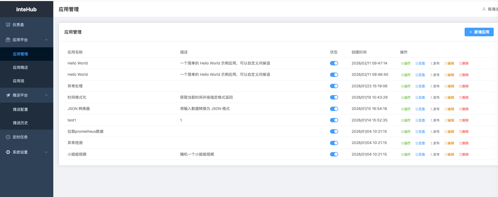
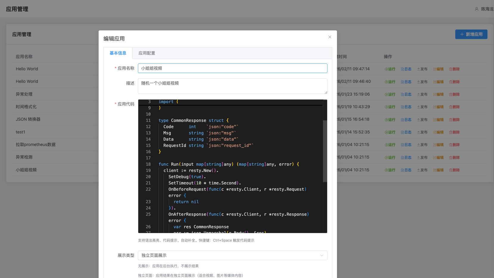
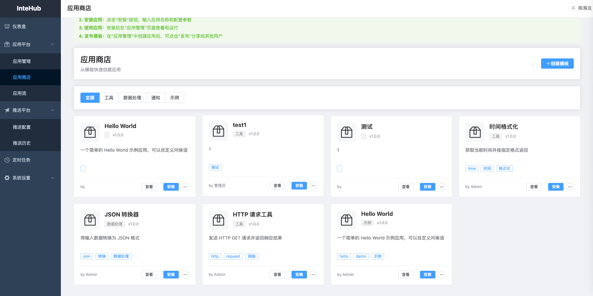
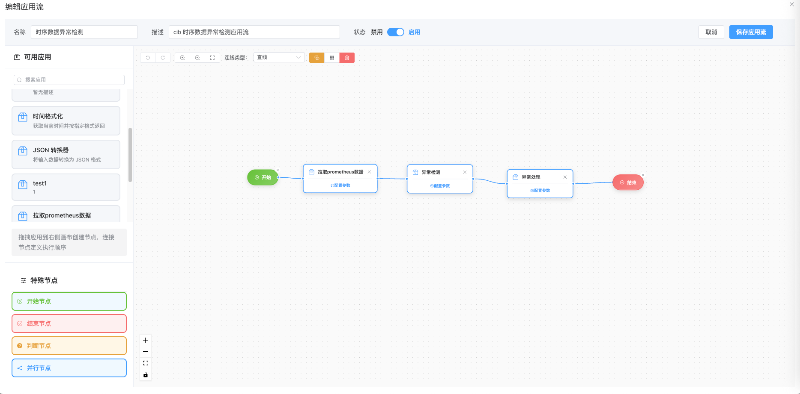
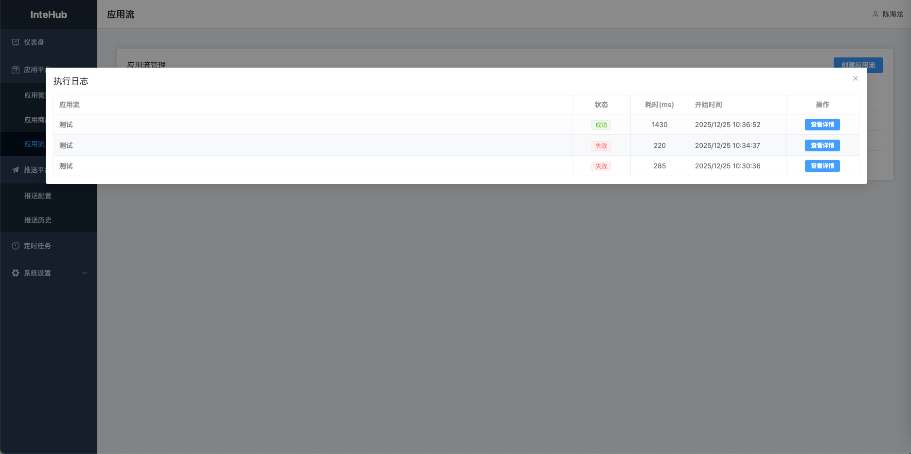
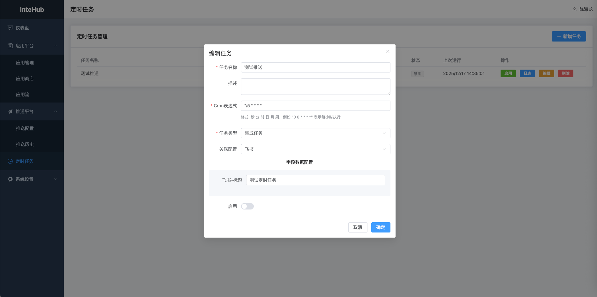
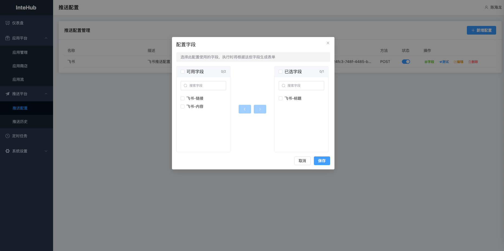

# InteHub - 智能集成平台

一个功能强大的集成平台，支持应用管理、工作流编排、定时任务和推送集成。

## 功能特性

### 核心功能
- 🚀 **应用管理** - 支持 Go 应用的在线编写、运行和管理
- 🔄 **应用流** - 可视化工作流编排，拖拽式设计应用执行流程
- 🏪 **应用商店** - 应用模板市场，一键安装常用应用
- ⏰ **定时任务** - 支持 Cron 表达式的定时任务调度
- 📤 **推送集成** - HTTP 推送配置和历史记录管理
- 👥 **用户管理** - 基于角色的权限控制（管理员/普通用户）
- 🔐 **JWT 认证** - 安全的用户认证和授权机制

### 应用特性
- 支持三种展示类型：无展示、独立页面、弹窗展示
- 应用配置管理（支持字符串、数字、布尔值、JSON）
- 应用执行日志记录
- 应用发布到商店

### 工作流特性
- 可视化流程设计器
- 支持开始/结束节点
- 支持判断节点（条件分支）
- 支持并行节点
- 节点参数配置
- 执行日志详情查看

## 界面预览

### 应用管理


### 应用编辑


### 应用商店


### 工作流编排


### 工作流执行日志


### 定时任务


### 推送配置



## 技术栈

### 后端
- **语言**: Go 1.24+
- **框架**: Gin Web Framework
- **ORM**: GORM
- **数据库**: PostgreSQL 16
- **认证**: JWT (golang-jwt/jwt)
- **依赖注入**: Google Wire
- **配置管理**: Viper
- **动态执行**: Yaegi (Go 解释器)

### 前端
- **框架**: Vue 3 + TypeScript
- **构建工具**: Vite
- **UI 组件**: Element Plus
- **状态管理**: Pinia
- **路由**: Vue Router
- **HTTP 客户端**: Axios
- **流程图**: Vue Flow
- **代码编辑器**: Monaco Editor

### 部署
- **容器化**: Docker + Docker Compose
- **CI/CD**: Jenkins Pipeline
- **反向代理**: Nginx

## 项目结构

```
intehub/
├── appl/                 # 应用运行时
│   ├── app.go           # 应用接口定义
│   └── goapp.go         # Go 应用实现
├── cmd/                 # 命令行入口
│   ├── server/          # 服务器启动
│   ├── provider.go      # 依赖注入配置
│   └── wire.go          # Wire 配置
├── internal/            # 内部包
│   ├── app/
│   │   ├── api/v1/     # API 处理器
│   │   ├── models/     # 数据模型
│   │   ├── service/    # 业务逻辑
│   │   ├── router/     # 路由配置
│   │   └── config/     # 配置结构
│   └── utils/          # 工具函数
├── runtime/             # 运行时库
│   └── yaegi/          # Yaegi 符号表
├── sql/                 # 数据库脚本
│   ├── schema.sql      # 数据库结构
│   └── migrations/     # 迁移脚本
├── ui/                  # 前端应用
│   ├── src/
│   │   ├── api/        # API 接口
│   │   ├── components/ # 组件
│   │   ├── views/      # 页面
│   │   ├── router/     # 路由
│   │   └── stores/     # 状态管理
│   ├── nginx.conf      # Nginx 配置
│   └── package.json
├── Dockerfile.backend   # 后端镜像
├── Dockerfile.frontend  # 前端镜像
├── Jenkinsfile         # CI/CD 配置
├── config.yaml         # 应用配置
└── README.md
```

## 快速开始

### 环境要求
- Go 1.24+
- Node.js 18+
- PostgreSQL 16+
- Docker & Docker Compose (可选)

### 本地开发

#### 1. 启动数据库
```bash
# 使用 Docker 启动 PostgreSQL
docker run -d \
  --name intehub-postgres \
  -e POSTGRES_DB=intehub \
  -e POSTGRES_USER=intehub \
  -e POSTGRES_PASSWORD=intehub123 \
  -p 5432:5432 \
  postgres:16-alpine
```

#### 2. 配置后端
```bash
# 复制配置文件
cp config.yaml.example config.yaml

# 修改数据库连接
# postgresql:
#   uri: "host=localhost port=5432 user=intehub password=intehub123 dbname=intehub sslmode=disable"
```

#### 3. 启动后端
```bash
# 安装依赖
go mod download

# 生成 Wire 代码
cd cmd && wire && cd ..

# 运行
go run cmd/server/main.go
```

后端服务运行在 `http://localhost:8080`

#### 4. 启动前端
```bash
cd ui

# 安装依赖
yarn install

# 开发模式
yarn dev
```

前端应用运行在 `http://localhost:5173`

### Docker 部署

#### 使用 Jenkins 自动部署
```bash
# 配置 Jenkins Pipeline
# 1. 创建 Pipeline 项目
# 2. 配置 Git 仓库
# 3. 使用 Jenkinsfile
# 4. 构建即可自动部署
```

#### 手动 Docker 部署
```bash
# 构建镜像
docker build -t intehub-backend:latest -f Dockerfile.backend .
docker build -t intehub-frontend:latest -f Dockerfile.frontend .

# 创建网络
docker network create intehub-network

# 启动数据库
docker run -d \
  --name intehub-postgres \
  --network intehub-network \
  -e POSTGRES_DB=intehub \
  -e POSTGRES_USER=intehub \
  -e POSTGRES_PASSWORD=intehub123 \
  -v intehub-postgres-data:/var/lib/postgresql/data \
  postgres:16-alpine

# 启动后端
docker run -d \
  --name intehub-backend \
  --network intehub-network \
  -e INTEHUB_POSTGRESQL_URI="host=intehub-postgres port=5432 user=intehub password=intehub123 dbname=intehub sslmode=disable" \
  -e INTEHUB_SERVER_PORT=8080 \
  -e INTEHUB_JWT_SECRET="your-secret-key" \
  -p 8080:8080 \
  intehub-backend:latest

# 启动前端
docker run -d \
  --name intehub-frontend \
  --network intehub-network \
  -p 80:80 \
  intehub-frontend:latest
```

访问 `http://localhost` 即可使用

## 环境变量配置

后端支持通过环境变量覆盖配置文件：

| 环境变量 | 说明 | 默认值 |
|---------|------|--------|
| `INTEHUB_DEBUG` | 调试模式 | `false` |
| `INTEHUB_SERVER_PORT` | 服务端口 | `8080` |
| `INTEHUB_POSTGRESQL_URI` | 数据库连接 | - |
| `INTEHUB_JWT_SECRET` | JWT 密钥 | - |
| `INTEHUB_API_PREFIX` | API 前缀 | `/api/v1` |

## API 文档

### 认证
- `POST /api/v1/auth/login` - 用户登录
- `POST /api/v1/auth/logout` - 用户登出

### 应用管理
- `GET /api/v1/apps` - 获取应用列表
- `GET /api/v1/apps/:id` - 获取应用详情
- `POST /api/v1/apps` - 创建应用
- `PUT /api/v1/apps/:id` - 更新应用
- `DELETE /api/v1/apps/:id` - 删除应用
- `POST /api/v1/apps/:id/run` - 运行应用
- `GET /api/v1/apps/logs` - 获取应用日志
- `POST /api/v1/apps/:id/publish` - 发布到应用商店

### 应用商店
- `GET /api/v1/appstore/templates` - 获取模板列表
- `POST /api/v1/appstore/install/:id` - 安装模板

### 工作流
- `GET /api/v1/workflows` - 获取工作流列表
- `POST /api/v1/workflows` - 创建工作流
- `PUT /api/v1/workflows/:id` - 更新工作流
- `DELETE /api/v1/workflows/:id` - 删除工作流
- `POST /api/v1/workflows/:id/run` - 运行工作流
- `GET /api/v1/workflows/logs` - 获取工作流日志

### 定时任务
- `GET /api/v1/schedule/tasks` - 获取任务列表
- `POST /api/v1/schedule/tasks` - 创建任务
- `PUT /api/v1/schedule/tasks/:id` - 更新任务
- `DELETE /api/v1/schedule/tasks/:id` - 删除任务

### 推送配置
- `GET /api/v1/push/configs` - 获取配置列表
- `POST /api/v1/push/configs` - 创建配置
- `PUT /api/v1/push/configs/:id` - 更新配置
- `DELETE /api/v1/push/configs/:id` - 删除配置
- `POST /api/v1/push/send` - 执行推送
- `GET /api/v1/push/history` - 获取推送历史

## 默认账户

- **用户名**: `admin`
- **密码**: `admin123`

⚠️ 生产环境请务必修改默认密码！

## 开发指南

### 添加新的应用类型
1. 在 `appl/` 目录创建新的应用实现
2. 实现 `Runnable` 接口
3. 在 `service/app/service.go` 中注册新类型

### 添加新的 API
1. 在 `internal/app/api/v1/` 创建新的 handler
2. 在 `cmd/provider.go` 注册 handler
3. 在 `internal/app/router/` 配置路由

### 前端开发
```bash
cd ui
yarn dev    # 开发模式
yarn build  # 生产构建
```

## 常见问题

### 数据库连接失败
检查 PostgreSQL 是否启动，配置是否正确

### 应用运行失败
查看应用日志，检查代码语法是否正确

### 前端无法访问后端
检查 Nginx 配置，确保反向代理配置正确

## 贡献指南

欢迎提交 Issue 和 Pull Request！

## License

MIT License
